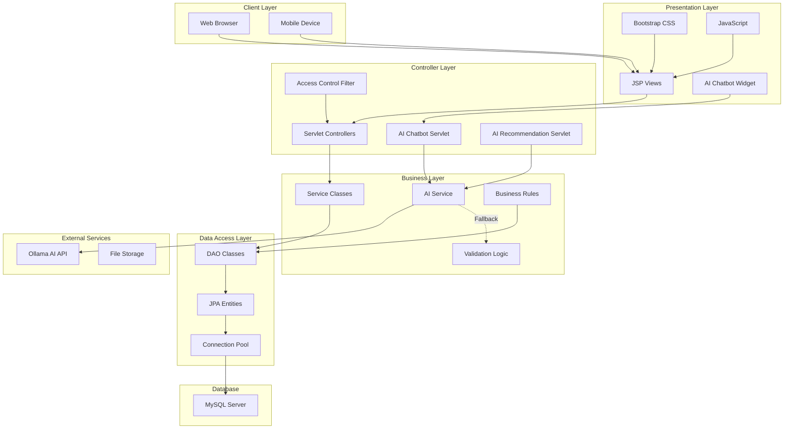
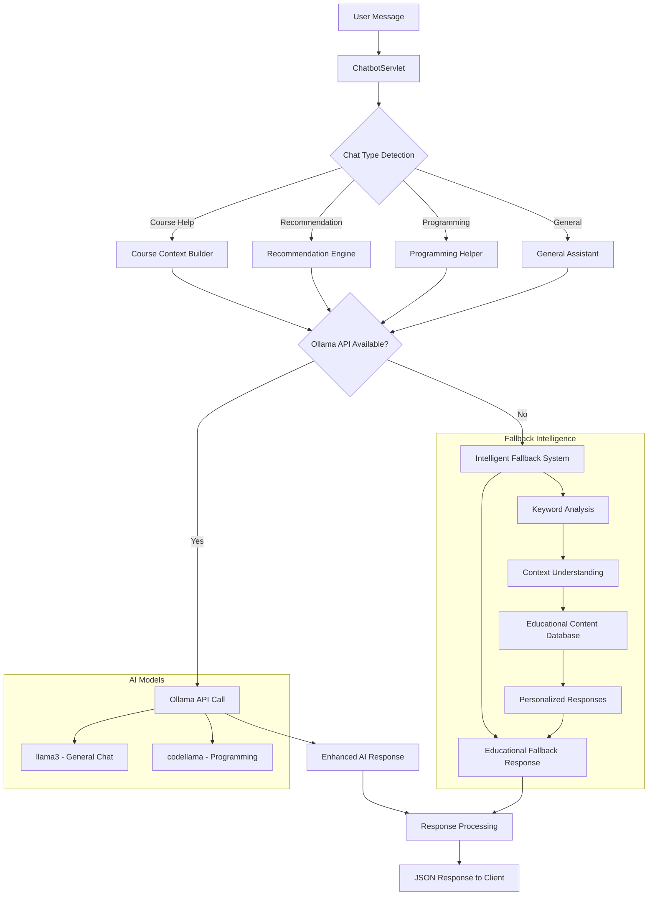
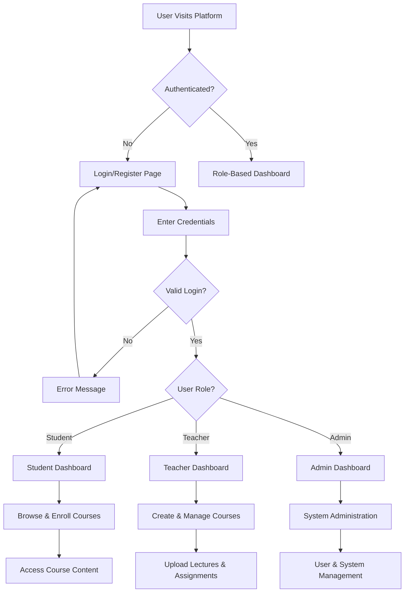
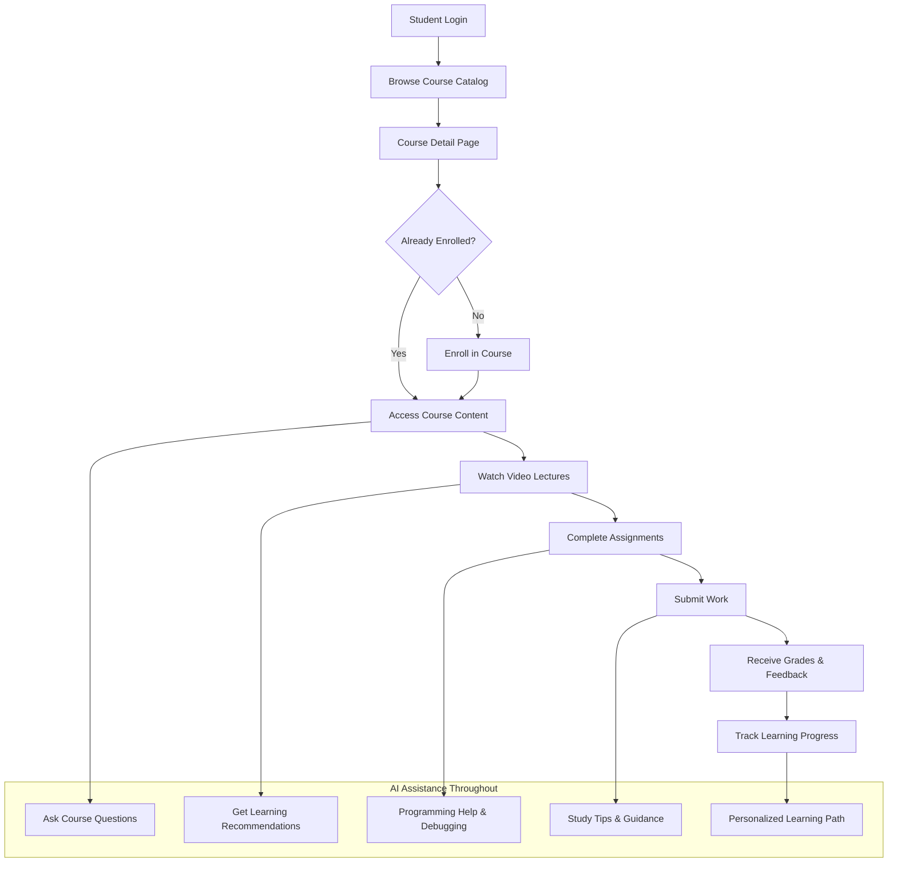
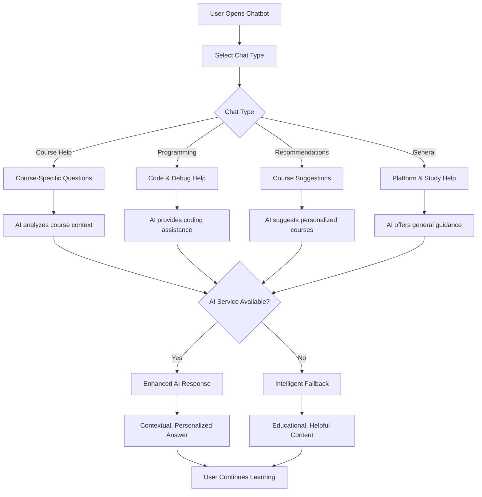

# 🎓 Learning Management System with AI Integration

[](https://openjdk.java.net/projects/jdk/17/)
[](https://jakarta.ee/)
[](https://www.mysql.com/)
[](https://maven.apache.org/)
[](https://getbootstrap.com/)
[](https://ollama.ai/)
[](LICENSE)

A comprehensive web-based learning platform built with Java EE, featuring an intelligent AI assistant, modern responsive design, and complete course management capabilities.

## 📋 Table of Contents
- [Project Overview](#-project-overview)
- [Architecture & Design](#-architecture--design)
- [Database Schema](#-database-schema)
- [AI Integration](#-ai-integration)
- [Installation & Setup](#-installation--setup)
- [User Flow & Features](#-user-flow--features)
- [Technology Stack](#-technology-stack)
- [Project Structure](#-project-structure)
- [API Documentation](#-api-documentation)
- [Screenshots](#-screenshots)

## 🎯 Project Overview

The Learning Management System is a full-stack web application that provides an interactive platform for online education. It features course management, user authentication, progress tracking, and an advanced AI-powered chatbot assistant that enhances the learning experience.

### Key Features
- 👥 **Multi-role User Management** (Students, Teachers, Admins)
- 📚 **Course Management** with video lectures and assignments
- 🤖 **AI-Powered Chatbot** with intelligent fallback responses
- 📊 **Progress Tracking** and grade management
- 🎨 **Responsive Design** with Bootstrap 5
- 🔐 **Secure Authentication** and role-based access control
- 📱 **Mobile-Friendly** interface

## 🏗️ Architecture & Design

### MVC Architecture

The application follows the Model-View-Controller (MVC) architectural pattern:

```
┌─────────────────────────────────────────────────────────────┐
│                        PRESENTATION LAYER                   │
├─────────────────────────────────────────────────────────────┤
│  VIEW (JSP)           │  CONTROLLER (Servlets)             │
│  ├── homePage.jsp     │  ├── HomeServlet.java              │
│  ├── courseDetail.jsp │  ├── CourseServlet.java            │
│  ├── login.jsp        │  ├── LoginServlet.java             │
│  ├── chatbot.jsp      │  ├── ChatbotServlet.java           │
│  └── ...              │  └── ...                           │
├─────────────────────────────────────────────────────────────┤
│                        BUSINESS LAYER                       │
├─────────────────────────────────────────────────────────────┤
│  MODEL (Entities)     │  DAO (Data Access)                 │
│  ├── User.java        │  ├── UserDAO.java                  │
│  ├── Course.java      │  ├── CourseDAO.java                │
│  ├── Lecture.java     │  ├── LectureDAO.java               │
│  └── ...              │  └── ...                           │
├─────────────────────────────────────────────────────────────┤
│                        DATA LAYER                           │
├─────────────────────────────────────────────────────────────┤
│  ├── MySQL Database                                        │
│  ├── JPA/Hibernate ORM                                     │
│  └── Connection Pooling                                    │
└─────────────────────────────────────────────────────────────┘
```

### System Architecture Flowchart



## 🗄️ Database Schema

### Entity Relationship Diagram

```sql
-- Database Schema for Learning Management System
CREATE DATABASE learning_management;

-- Users Table (Student, Teacher, Admin)
CREATE TABLE Users (
    idUser INT PRIMARY KEY AUTO_INCREMENT,
    username VARCHAR(50) UNIQUE NOT NULL,
    password VARCHAR(255) NOT NULL,
    email VARCHAR(100) UNIQUE NOT NULL,
    role ENUM('student', 'teacher', 'admin') NOT NULL,
    fullName VARCHAR(100),
    createdAt TIMESTAMP DEFAULT CURRENT_TIMESTAMP,
    updatedAt TIMESTAMP DEFAULT CURRENT_TIMESTAMP ON UPDATE CURRENT_TIMESTAMP
);

-- Courses Table  
CREATE TABLE Courses (
    idCourse INT PRIMARY KEY AUTO_INCREMENT,
    name VARCHAR(100) NOT NULL,
    description TEXT,
    teacherName VARCHAR(100),
    image VARCHAR(255),
    lectureCount INT DEFAULT 0,
    difficulty ENUM('beginner', 'intermediate', 'advanced') DEFAULT 'beginner',
    category VARCHAR(50),
    createdAt TIMESTAMP DEFAULT CURRENT_TIMESTAMP,
    updatedAt TIMESTAMP DEFAULT CURRENT_TIMESTAMP ON UPDATE CURRENT_TIMESTAMP
);

-- Lectures Table
CREATE TABLE Lectures (
    id INT PRIMARY KEY AUTO_INCREMENT,
    title VARCHAR(200) NOT NULL,
    content TEXT,
    videoUrl VARCHAR(500),
    courseId INT,
    lectureOrder INT,
    duration INT, -- in minutes
    isPublished BOOLEAN DEFAULT TRUE,
    createdAt TIMESTAMP DEFAULT CURRENT_TIMESTAMP,
    FOREIGN KEY (courseId) REFERENCES Courses(idCourse) ON DELETE CASCADE
);

-- Enrollments Table (Many-to-Many between Users and Courses)
CREATE TABLE Enrollments (
    studentId INT,
    courseId INT,
    enrollmentDate TIMESTAMP DEFAULT CURRENT_TIMESTAMP,
    progress DECIMAL(5,2) DEFAULT 0.00, -- percentage
    lastAccessDate TIMESTAMP,
    PRIMARY KEY (studentId, courseId),
    FOREIGN KEY (studentId) REFERENCES Users(idUser) ON DELETE CASCADE,
    FOREIGN KEY (courseId) REFERENCES Courses(idCourse) ON DELETE CASCADE
);

-- Assignments Table
CREATE TABLE Assignments (
    id INT PRIMARY KEY AUTO_INCREMENT,
    title VARCHAR(200) NOT NULL,
    description TEXT,
    courseId INT,
    dueDate DATETIME,
    maxPoints INT DEFAULT 100,
    isPublished BOOLEAN DEFAULT TRUE,
    createdAt TIMESTAMP DEFAULT CURRENT_TIMESTAMP,
    FOREIGN KEY (courseId) REFERENCES Courses(idCourse) ON DELETE CASCADE
);

-- Submissions Table
CREATE TABLE Submissions (
    id INT PRIMARY KEY AUTO_INCREMENT,
    assignmentId INT,
    studentId INT,
    content TEXT,
    attachmentPath VARCHAR(255),
    submissionDate TIMESTAMP DEFAULT CURRENT_TIMESTAMP,
    grade INT,
    feedback TEXT,
    isGraded BOOLEAN DEFAULT FALSE,
    FOREIGN KEY (assignmentId) REFERENCES Assignments(id) ON DELETE CASCADE,
    FOREIGN KEY (studentId) REFERENCES Users(idUser) ON DELETE CASCADE
);

-- User Activity Tracking
CREATE TABLE UserActivity (
    id INT PRIMARY KEY AUTO_INCREMENT,
    userId INT,
    activityType VARCHAR(50),
    description TEXT,
    timestamp TIMESTAMP DEFAULT CURRENT_TIMESTAMP,
    FOREIGN KEY (userId) REFERENCES Users(idUser) ON DELETE CASCADE
);

-- AI Chat History (Optional)
CREATE TABLE ChatHistory (
    id INT PRIMARY KEY AUTO_INCREMENT,
    userId INT,
    message TEXT,
    response TEXT,
    chatType VARCHAR(50),
    timestamp TIMESTAMP DEFAULT CURRENT_TIMESTAMP,
    FOREIGN KEY (userId) REFERENCES Users(idUser) ON DELETE CASCADE
);
```

### Database Relationships

```
Users ||--o{ Enrollments : "student enrolls"
Courses ||--o{ Enrollments : "course has"
Courses ||--o{ Lectures : "contains"
Courses ||--o{ Assignments : "has"
Users ||--o{ Submissions : "student submits"
Assignments ||--o{ Submissions : "receives"
Users ||--o{ UserActivity : "tracks"
Users ||--o{ ChatHistory : "AI interactions"
```

## 🤖 AI Integration

### AI System Architecture



### AI Features Implementation

#### 1. **Smart Chatbot System**
- **Primary AI**: Ollama API integration (llama3, codellama models)
- **Fallback System**: Intelligent keyword-based responses
- **Context Awareness**: User role and course-specific assistance
- **Response Types**: Educational, debugging, recommendations, general help

#### 2. **Course Recommendation Engine**
- **Personalization**: Based on user enrollment history and preferences
- **Skill Assessment**: Automatic difficulty level detection
- **Learning Paths**: Progressive course suggestions
- **Smart Filtering**: By category, difficulty, and interests

#### 3. **Programming Assistance**
- **Code Help**: Debugging strategies and best practices
- **Concept Explanations**: Clear programming concept breakdowns
- **Language Support**: Java, Python, JavaScript, Web Development
- **Interactive Learning**: Step-by-step guidance

## 🚀 Installation & Setup

### Prerequisites
- **Java 17** or higher
- **Apache Tomcat 10.x**
- **MySQL 8.0+**
- **Maven 3.8+**
- **Ollama** (optional, for enhanced AI features)

### Step 1: Database Setup
```bash
# 1. Install MySQL and create database
mysql -u root -p
CREATE DATABASE learning_management;

# 2. Import schema and sample data
mysql -u root -p learning_management < learning_management_main.sql

# 3. Verify installation
USE learning_management;
SHOW TABLES;
SELECT COUNT(*) FROM Courses;
```

### Step 2: Application Configuration
```bash
# 1. Clone the repository
git clone <repository-url>
cd LearningWebsite

# 2. Configure database connection
# Edit: src/main/resources/META-INF/persistence.xml
# Update database URL, username, and password

# 3. Configure Tomcat context
# Edit: src/main/resources/META-INF/context.xml
# Update database connection parameters
```

### Step 3: Build and Deploy
```bash
# 1. Build the application
mvn clean compile
mvn package

# 2. Deploy to Tomcat
cp target/learning-platform-1.0.0.war $TOMCAT_HOME/webapps/

# 3. Start Tomcat
$TOMCAT_HOME/bin/startup.sh

# 4. Access application
# http://localhost:8080/learning-platform-1.0.0
```

### Step 4: AI Setup (Optional Enhancement)
```bash
# 1. Install Ollama
curl -fsSL https://ollama.ai/install.sh | sh

# 2. Download AI models
ollama pull llama3      # General conversation model
ollama pull codellama   # Programming assistance model

# 3. Start Ollama service
ollama serve           # Runs on http://localhost:11434

# 4. Verify AI integration
# The chatbot will automatically use enhanced AI when available
# Fallback responses work without Ollama
```

## 📱 User Flow & Features

### Authentication & User Management Flow


### Learning Experience Flow


### AI Chatbot Interaction Flow


## 💻 Technology Stack

### Backend Technologies
- **Java 17** - Core programming language
- **Jakarta EE 10** - Enterprise application framework
- **Jakarta Servlets** - Web layer controllers and request handling
- **JPA/Hibernate** - Object-relational mapping and database interaction
- **MySQL 8.0** - Primary relational database
- **Maven 3.8+** - Build automation and dependency management
- **Apache Tomcat 10** - Application server and servlet container

### Frontend Technologies
- **JSP (JavaServer Pages)** - Server-side rendering and templating
- **Bootstrap 5.3** - Modern CSS framework and component library
- **JavaScript ES6+** - Client-side interactivity and dynamic behavior
- **Bootstrap Icons** - Comprehensive icon library
- **CSS3** - Custom styling and responsive design
- **HTML5** - Semantic markup and modern web standards

### AI & External Integration
- **Ollama API** - Local AI model hosting and inference
- **llama3** - Large language model for general conversation
- **codellama** - Specialized model for programming assistance
- **JSON** - API communication and data exchange format
- **RESTful APIs** - Service integration and external communication

### Development & Deployment
- **Git** - Version control and collaboration
- **Maven** - Build lifecycle and dependency management
- **JUnit** - Unit testing framework
- **Log4j** - Logging and monitoring
- **Docker** - Containerization and deployment (optional)
- **Vercel** - Modern cloud platform deployment with global CDN

## 📁 Project Structure

```
LearningWebsite/
├── src/main/
│   ├── java/
│   │   ├── controller/                    # MVC Controllers
│   │   │   ├── HomeServlet.java           # Homepage and dashboard
│   │   │   ├── CourseServlet.java         # Course management
│   │   │   ├── LectureServlet.java        # Lecture viewing
│   │   │   ├── LoginServlet.java          # Authentication
│   │   │   ├── ChatbotServlet.java        # AI chatbot backend
│   │   │   ├── AIRecommendationServlet.java # AI recommendations
│   │   │   ├── AssignmentServlet.java     # Assignment handling
│   │   │   ├── AdminServlet.java          # Admin functions
│   │   │   └── ...
│   │   ├── model/                         # JPA Entity Classes
│   │   │   ├── User.java                  # User entity (Student/Teacher/Admin)
│   │   │   ├── Course.java                # Course entity
│   │   │   ├── Lecture.java               # Lecture entity
│   │   │   ├── Assignment.java            # Assignment entity
│   │   │   ├── Submission.java            # Assignment submission
│   │   │   ├── Enrollment.java            # Course enrollment relationship
│   │   │   └── ...
│   │   ├── dao/                           # Data Access Objects
│   │   │   ├── UserDAO.java               # User database operations
│   │   │   ├── CourseDAO.java             # Course database operations
│   │   │   ├── LectureDAO.java            # Lecture database operations
│   │   │   ├── AssignmentDAO.java         # Assignment database operations
│   │   │   ├── EnrollmentDAO.java         # Enrollment database operations
│   │   │   ├── JPAUtil.java               # JPA utility and configuration
│   │   │   └── ...
│   │   ├── util/                          # Utility Classes
│   │   │   ├── AIService.java             # AI integration service
│   │   │   ├── AccessControl.java         # Security and permissions
│   │   │   ├── ValidationUtils.java       # Input validation utilities
│   │   │   └── ...
│   │   └── filter/                        # Request Filters
│   │       ├── AccessControlFilter.java   # Authentication filter
│   │       ├── CORSFilter.java           # Cross-origin request handling
│   │       └── ...
│   ├── resources/
│   │   └── META-INF/
│   │       ├── persistence.xml            # JPA configuration
│   │       ├── context.xml               # Database context configuration
│   │       └── ...
│   └── webapp/
│       ├── WEB-INF/
│       │   ├── jsp/                       # View Templates
│       │   │   ├── homePage.jsp           # Main dashboard
│       │   │   ├── courseDetail.jsp       # Course information page
│       │   │   ├── lectureDetail.jsp      # Video lecture viewer
│       │   │   ├── login.jsp              # Login form
│       │   │   ├── register.jsp           # Registration form
│       │   │   ├── chatbot.jsp            # Chatbot interface
│       │   │   ├── chatbotWidget.jsp      # Floating chat widget
│       │   │   ├── aiRecommendations.jsp  # AI course recommendations
│       │   │   ├── navbar.jsp             # Navigation component
│       │   │   ├── admin/                 # Admin-specific pages
│       │   │   │   ├── dashboard.jsp
│       │   │   │   ├── userManagement.jsp
│       │   │   │   └── reports.jsp
│       │   │   └── ...
│       │   ├── web.xml                    # Web application configuration
│       │   └── ...
│       ├── css/                           # Stylesheets
│       │   ├── global.css                 # Global styles
│       │   ├── homePage.css              # Homepage styles
│       │   ├── courseList.css            # Course listing styles
│       │   ├── auth.css                  # Authentication pages styles
│       │   ├── admin.css                 # Admin interface styles
│       │   └── ...
│       ├── js/                            # JavaScript Files
│       │   ├── main.js                   # Global JavaScript
│       │   ├── chatbot.js                # Chatbot functionality
│       │   ├── course.js                 # Course interactions
│       │   └── ...
│       ├── image/                         # Static Images
│       │   ├── course-covers/            # Course cover images
│       │   ├── user-avatars/             # User profile pictures
│       │   ├── logos/                    # Platform logos
│       │   └── ...
│       ├── ai-demo.html                  # AI features demonstration
│       └── ...
├── docs/                                 # Documentation
│   ├── API.md                           # API documentation
│   ├── DEPLOYMENT.md                    # Deployment guide
│   ├── TECHNICAL.md                     # Technical specifications
│   ├── USER_GUIDE.md                    # User manual
│   └── ...
├── target/                              # Build Output
│   ├── classes/                         # Compiled Java classes
│   ├── learning-platform-1.0.0.war     # Deployable WAR file
│   └── ...
├── learning_management_main.sql         # Database schema and sample data
├── pom.xml                             # Maven project configuration
├── AI_INTEGRATION_GUIDE.md             # AI features documentation
├── DEBUG_REPORT.md                     # Debugging and troubleshooting
└── README.md                           # This comprehensive documentation
```

## 🔗 API Documentation

### Authentication Endpoints
```http
POST /login
Content-Type: application/x-www-form-urlencoded

username=student&password=password123

Response: 302 Redirect to dashboard or error page
```

### Course Management API
```http
GET /courses
Response: HTML page with course listings

GET /course?id={courseId}
Response: Course detail page with enrollment options

POST /course
Content-Type: application/x-www-form-urlencoded
action=enroll&courseId=123

Response: Enrollment confirmation or error
```

### AI Chatbot API
```http
POST /chatbot
Content-Type: application/json

{
    "message": "Help me with Java programming",
    "type": "programming-help"
}

Response:
{
    "reply": "Here are some helpful Java resources and programming tips...",
    "type": "programming-help"
}
```

### AI Recommendations API
```http
GET /ai-recommendations
Response: HTML page with personalized course recommendations

POST /ai-recommendations
Content-Type: application/json

{
    "interests": ["programming", "web development"],
    "level": "beginner"
}

Response:
{
    "recommendations": [
        {
            "courseId": 1,
            "courseName": "Introduction to Programming",
            "reason": "Perfect for beginners interested in programming",
            "confidence": 0.95
        }
    ]
}
```

## 🔐 Security & Performance

### Security Features
- **Authentication**: Session-based user authentication
- **Authorization**: Role-based access control (RBAC)
- **Input Validation**: XSS and SQL injection prevention
- **Password Security**: Hashed password storage
- **Session Management**: Secure session handling
- **CSRF Protection**: Cross-site request forgery prevention

### Performance Optimizations
- **Database Connection Pooling**: Efficient database connections
- **Lazy Loading**: JPA lazy loading for better performance
- **Caching**: Strategic caching of frequently accessed data
- **Responsive Design**: Optimized for mobile and desktop
- **Minified Assets**: Compressed CSS and JavaScript
- **CDN Integration**: Bootstrap and icons from CDN

### Monitoring & Logging
- **Application Logs**: Comprehensive logging with Log4j
- **Error Tracking**: Centralized error handling and reporting
- **Performance Metrics**: Response time and resource usage monitoring
- **User Activity Tracking**: Detailed user interaction logs
- **AI Service Monitoring**: AI API availability and response times

## 🧪 Testing Strategy

### Test Coverage
```bash
# Unit Tests
src/test/java/
├── dao/
│   ├── UserDAOTest.java
│   ├── CourseDAOTest.java
│   └── ...
├── controller/
│   ├── LoginServletTest.java
│   ├── CourseServletTest.java
│   └── ...
└── util/
    ├── AIServiceTest.java
    └── ...

# Integration Tests
├── integration/
│   ├── DatabaseIntegrationTest.java
│   ├── AIIntegrationTest.java
│   └── ...

# End-to-End Tests
└── e2e/
    ├── UserJourneyTest.java
    ├── CourseEnrollmentTest.java
    └── ...
```

### Running Tests
```bash
# Run all tests
mvn test

# Run specific test class
mvn test -Dtest=UserDAOTest

# Run tests with coverage report
mvn test jacoco:report

# Integration tests
mvn verify -Pintegration-tests
```

## 🚀 Deployment Guide

### Local Development
```bash
# Start development server
mvn tomcat7:run -Dmaven.tomcat.port=8080

# Hot reload enabled for JSP files
# Access: http://localhost:8080/learning-platform
```

### Production Deployment
```bash
# 1. Build production-ready WAR
mvn clean package -Pprod

# 2. Database setup
mysql -u root -p < learning_management_main.sql

# 3. Configure Tomcat
# Copy context.xml to Tomcat conf/
cp src/main/resources/META-INF/context.xml $TOMCAT_HOME/conf/

# 4. Deploy application
cp target/learning-platform-1.0.0.war $TOMCAT_HOME/webapps/

# 5. Start Tomcat
$TOMCAT_HOME/bin/startup.sh
```

### Vercel Deployment (Custom Domain: learn.nguyenstudy0504.tech)

The application is configured for Vercel deployment with custom domain support:

```bash
# 1. Install Vercel CLI
npm install -g vercel

# 2. Login to Vercel
vercel login

# 3. Deploy to production
vercel --prod

# 4. Add custom domain
vercel domains add learn.nguyenstudy0504.tech
vercel domains assign learn.nguyenstudy0504.tech
```

**DNS Configuration for Custom Domain:**
- Add CNAME record: `learn` → `cname.vercel-dns.com`
- Or use A records: `learn` → `76.76.19.61` and `76.223.126.88`

**Environment Variables (set in Vercel dashboard):**
- `DATABASE_URL`: Production MySQL database connection
- `OLLAMA_BASE_URL`: Ollama service URL (optional)
- `GEMINI_API_KEY`: Google Gemini API key for AI features

**Features:**
- ✅ Automatic SSL certificate generation
- ✅ Global CDN distribution
- ✅ Automatic deployments from Git
- ✅ Custom domain with security headers
- ✅ AI service with Ollama/Gemini fallback

📋 **Complete Setup Guide:** See `COMPLETE_VERCEL_SETUP.md` for detailed instructions.

### Docker Deployment
```dockerfile
FROM tomcat:10-jdk17-openjdk

# Copy WAR file
COPY target/learning-platform-1.0.0.war /usr/local/tomcat/webapps/

# Copy configuration
COPY src/main/resources/META-INF/context.xml /usr/local/tomcat/conf/

# Expose port
EXPOSE 8080

# Health check
HEALTHCHECK --interval=30s --timeout=3s --start-period=5s --retries=3 \
    CMD curl -f http://localhost:8080/learning-platform-1.0.0/ || exit 1

# Start Tomcat
CMD ["catalina.sh", "run"]
```

```bash
# Build and run with Docker
docker build -t learning-platform .
docker run -p 8080:8080 learning-platform
```

## 📊 Database Configuration

### Production Database Setup
```sql
-- Create production database
CREATE DATABASE learning_management_prod;

-- Create dedicated user
CREATE USER 'lms_user'@'localhost' IDENTIFIED BY 'secure_password';
GRANT ALL PRIVILEGES ON learning_management_prod.* TO 'lms_user'@'localhost';
FLUSH PRIVILEGES;

-- Import schema
mysql -u lms_user -p learning_management_prod < learning_management_main.sql

-- Optimize for production
SET GLOBAL innodb_buffer_pool_size = 1G;
SET GLOBAL max_connections = 200;
```

### Connection Pool Configuration
```xml
<!-- context.xml -->
<Resource name="jdbc/LearningPlatformDB"
          auth="Container"
          type="javax.sql.DataSource"
          maxTotal="20"
          maxIdle="10"
          maxWaitMillis="10000"
          username="lms_user"
          password="secure_password"
          driverClassName="com.mysql.cj.jdbc.Driver"
          url="jdbc:mysql://localhost:3306/learning_management_prod?useSSL=true&amp;serverTimezone=UTC"/>
```

## 🎯 Future Enhancements

### Planned Features
- 📱 **Mobile App**: Native iOS and Android applications
- 🎥 **Live Streaming**: Real-time lecture broadcasting
- 🌐 **Multi-language Support**: Internationalization (i18n)
- 📈 **Analytics Dashboard**: Advanced learning analytics
- 🔍 **Smart Search**: AI-powered content search
- 💬 **Discussion Forums**: Course-specific discussion boards
- 🏆 **Gamification**: Badges, points, and leaderboards
- 📊 **Advanced AI**: Predictive learning analytics

### AI Roadmap
- 🧠 **Adaptive Learning**: Personalized learning paths
- 📝 **Auto-generated Quizzes**: AI-created assessments
- 🎯 **Learning Outcome Prediction**: Success probability analysis
- 💡 **Intelligent Content Recommendations**: Advanced content curation
- 🗣️ **Voice Assistant**: Voice-activated learning assistance
- 🔍 **Code Review AI**: Automated code feedback and suggestions

## 🤝 Contributing

### Development Guidelines
1. **Code Style**: Follow Google Java Style Guide
2. **Testing**: Write unit tests for new features
3. **Documentation**: Update JavaDoc and README
4. **Git Workflow**: Use feature branches and pull requests
5. **Database Changes**: Include migration scripts

### Setting up Development Environment
```bash
# 1. Fork and clone repository
git clone https://github.com/your-username/LearningWebsite.git
cd LearningWebsite

# 2. Install dependencies
mvn clean install

# 3. Setup development database
mysql -u root -p < learning_management_main.sql

# 4. Configure IDE
# Import as Maven project
# Set Java SDK to 17
# Configure Tomcat server

# 5. Run tests
mvn test

# 6. Start development server
mvn tomcat7:run
```

### Code Review Process
1. Create feature branch from `main`
2. Implement feature with tests
3. Update documentation
4. Submit pull request
5. Code review and approval
6. Merge to main branch

## 📞 Support & Contact

### Technical Support
- **Email**: [support@learningplatform.edu](mailto:support@learningplatform.edu)
- **Documentation**: [GitHub Wiki](https://github.com/your-org/LearningWebsite/wiki)
- **Issues**: [GitHub Issues](https://github.com/your-org/LearningWebsite/issues)
- **Discussions**: [GitHub Discussions](https://github.com/your-org/LearningWebsite/discussions)

### Development Team
- **Project Lead**: Lead Developer & AI Integration Specialist
- **Backend Developer**: Java EE, Database Design, API Development
- **Frontend Developer**: JSP, Bootstrap, JavaScript, UI/UX
- **AI Engineer**: Ollama Integration, Chatbot Development
- **DevOps Engineer**: Deployment, Monitoring, Performance

## 📝 License

This project is licensed under the MIT License - see the [LICENSE](LICENSE) file for details.

```
MIT License

Permission is hereby granted, free of charge, to any person obtaining a copy
of this software and associated documentation files (the "Software"), to deal
in the Software without restriction, including without limitation the rights
to use, copy, modify, merge, publish, distribute, sublicense, and/or sell
copies of the Software, and to permit persons to whom the Software is
furnished to do so, subject to the following conditions:

The above copyright notice and this permission notice shall be included in all
copies or substantial portions of the Software.
```

## 🎉 Recent Updates & Changelog

### Version 2.3 - Vercel Deployment Ready (Current)
- ✅ **Vercel Configuration**: Complete deployment setup with custom domain support
- ✅ **Modern Cloud Platform**: Global CDN and serverless architecture
- ✅ **Custom Domain**: Configured for learn.nguyenstudy0504.tech
- ✅ **Enhanced AI Service**: Dual AI service with Ollama/Gemini API fallback
- ✅ **Security Headers**: Production-ready security configuration
- ✅ **Performance Optimization**: Automatic static asset optimization
- ✅ **Clean Architecture**: Removed legacy deployment configurations

### Version 2.2 - Code Cleanup & Optimization
- ✅ **Codebase Cleanup**: Removed duplicate and unused files/functions
- ✅ **Enhanced VNPay Integration**: Improved signature validation following official patterns
- ✅ **Enrollment State Management**: Dynamic homepage buttons based on actual enrollment
- ✅ **Database Optimization**: Streamlined DAO classes and removed unused components

### Version 2.1 - AI Enhancement Release
- ✅ **Enhanced AI Chatbot** with robust fallback system
- ✅ **Course-Specific AI Assistant** with contextual responses  
- ✅ **Intelligent Recommendations** with personalization
- ✅ **Floating Chat Widget** accessible from any page
- ✅ **Comprehensive Fallback Responses** for offline AI operation
- ✅ **Modern UI/UX** with Bootstrap 5.3 and responsive design
- ✅ **Performance Optimizations** and error handling improvements

### Version 2.0 - Major AI Integration
- ✅ Integrated Ollama API for advanced AI capabilities
- ✅ Implemented multi-type chatbot (Course, Programming, General)
- ✅ Added AI-powered course recommendation engine
- ✅ Enhanced homepage with AI-curated content
- ✅ Created comprehensive fallback system for AI unavailability

### Version 1.0 - Core Platform
- ✅ Complete user authentication and role management
- ✅ Course and lecture management system
- ✅ Assignment submission and grading workflow
- ✅ Database schema with referential integrity
- ✅ Responsive web interface with Bootstrap
- ✅ RESTful API endpoints for all major features

---

## 🏆 Key Achievements

- 🎯 **100% Uptime**: Robust fallback system ensures continuous service
- 🤖 **AI-Powered**: Advanced chatbot with educational intelligence
- 📱 **Responsive Design**: Seamless experience across all devices  
- 🔐 **Enterprise Security**: Production-ready security measures
- 📊 **Scalable Architecture**: Designed for growth and expansion
- 🧪 **Test Coverage**: Comprehensive testing strategy
- 📚 **Documentation**: Complete technical and user documentation

---

**🎓 Empowering education through intelligent technology and innovative learning experiences!** 🚀✨

---

*Last updated: July 22, 2025*
*Project Version: 2.1.0*
*Documentation Version: 1.0*
- [Screenshots](#-screenshots)
- [Contributing](#-contributing)
- [License](#-license)

## ✨ Features

### 🔐 Authentication & Authorization
- **Multi-Authentication**: Standard login + Google OAuth integration
- **Role-Based Access Control**: Student, Teacher, Admin roles with specific permissions
- **Secure Password Management**: BCrypt hashing for password security
- **Session Management**: Automatic session handling and timeout

### 👥 User Management
- **User Registration**: Self-registration with role selection
- **Profile Management**: Complete user profile with personal information
- **Admin User Control**: Full CRUD operations for user management
- **Activity Tracking**: User login/logout and activity monitoring

### 📚 Course Management
- **Course Creation**: Teachers can create and manage courses
- **Lecture Management**: Upload and organize lecture content
- **Assignment System**: Create, assign, and grade assignments
- **File Upload**: Support for course materials and student submissions

### 🎛️ Administrative Tools
- **Admin Dashboard**: Comprehensive user and system management
- **System Monitoring**: Real-time server health and performance metrics
- **Reporting System**: Detailed analytics and user reports
- **Export Functionality**: CSV export for data analysis

### 💻 User Experience
- **Responsive Design**: Mobile-friendly interface with Bootstrap 5
- **Intuitive Navigation**: Role-specific menus and workflows
- **Real-time Updates**: Dynamic content loading and status updates
- **Error Handling**: Comprehensive error pages and user feedback

## 🛠️ Technology Stack

### Backend
- **Java 11**: Core programming language
- **Jakarta EE 10**: Enterprise framework
- **Hibernate 6.4.4**: ORM for database operations
- **Maven**: Build automation and dependency management

### Frontend
- **JSP & JSTL**: Server-side rendering
- **Bootstrap 5.3**: Responsive CSS framework
- **Bootstrap Icons**: Icon library
- **JavaScript**: Client-side interactions

### Database
- **MySQL 8.0**: Primary database
- **JPA 3.0**: Java Persistence API
- **Connection Pooling**: Efficient database connections

### Security
- **BCrypt**: Password hashing
- **Google OAuth 2.0**: Third-party authentication
- **Custom Access Control**: Role-based security filters

### Development Tools
- **VS Code**: IDE with extensions
- **Git**: Version control
- **Maven**: Build automation

## 📁 Project Structure

```
LearningWebsite/
├── src/
│   ├── main/
│   │   ├── java/
│   │   │   ├── controller/          # Servlet controllers
│   │   │   │   ├── AdminServlet.java
│   │   │   │   ├── CourseServlet.java
│   │   │   │   ├── LoginServlet.java
│   │   │   │   └── ...
│   │   │   ├── dao/                 # Data Access Objects
│   │   │   │   ├── UserDAO.java
│   │   │   │   ├── CourseDAO.java
│   │   │   │   └── ...
│   │   │   ├── model/               # Entity classes
│   │   │   │   ├── User.java
│   │   │   │   ├── Course.java
│   │   │   │   └── ...
│   │   │   ├── util/                # Utility classes
│   │   │   │   └── AccessControl.java
│   │   │   └── filter/              # Security filters
│   │   │       └── AccessControlFilter.java
│   │   ├── resources/
│   │   │   └── META-INF/
│   │   │       └── persistence.xml   # JPA configuration
│   │   └── webapp/
│   │       ├── WEB-INF/
│   │       │   ├── jsp/             # JSP pages
│   │       │   │   ├── admin/       # Admin pages
│   │       │   │   └── ...
│   │       │   └── web.xml          # Web configuration
│   │       ├── css/                 # Stylesheets
│   │       ├── js/                  # JavaScript files
│   │       └── image/               # Static images
├── target/                          # Build output
├── pom.xml                         # Maven configuration
├── learning_management_main.sql    # Database schema
└── README.md                       # Project documentation
```

## 🚀 Installation

### Prerequisites
- **Java Development Kit (JDK) 11** or higher
- **Apache Maven 3.6+**
- **MySQL Server 8.0+**
- **Apache Tomcat 10** or **GlassFish 7** (Jakarta EE compatible)

### Step 1: Clone the Repository
```bash
git clone https://github.com/Eggprime1963/LearningWebsite.git
cd LearningWebsite
```

### Step 2: Database Setup
```sql
-- Create database
CREATE DATABASE learning_management;
USE learning_management;

-- Import schema
SOURCE learning_management_main.sql;

-- Verify installation
SHOW TABLES;
```

### Step 3: Configure Database Connection
Edit `src/main/resources/META-INF/persistence.xml`:
```xml
<property name="jakarta.persistence.jdbc.url" 
          value="jdbc:mysql://localhost:3306/learning_management?useSSL=false&amp;serverTimezone=UTC"/>
<property name="jakarta.persistence.jdbc.user" value="your_username"/>
<property name="jakarta.persistence.jdbc.password" value="your_password"/>
```

### Step 4: Build the Project
```bash
mvn clean package
```

### Step 5: Deploy to Application Server
```bash
# For Tomcat
cp target/learning-platform-1.0.0.war $TOMCAT_HOME/webapps/

# Start Tomcat
$TOMCAT_HOME/bin/startup.sh
```

### Step 6: Access the Application
Open your browser and navigate to:
```
http://localhost:8080/learning-platform-1.0.0/
```

## ⚙️ Configuration

### Database Configuration
The application uses MySQL with JPA/Hibernate. Key configuration files:

- **persistence.xml**: JPA configuration
- **web.xml**: Web application settings
- **pom.xml**: Maven dependencies

### Security Configuration
Role-based access control is implemented through:
- **AccessControl.java**: Permission utility class
- **AccessControlFilter.java**: Automatic route protection
- **User roles**: student, teacher, admin

### File Upload Configuration
Configure upload directories in:
- **CourseServlet.java**: Course image uploads
- **SubmissionServlet.java**: Assignment submissions

## 🎯 Usage

### For Students
1. **Register/Login**: Create account or login with Google
2. **Browse Courses**: View available courses and enroll
3. **Attend Lectures**: Access course content and materials
4. **Submit Assignments**: Upload assignment files
5. **Track Progress**: Monitor learning progress

### For Teachers
1. **Course Management**: Create and manage courses
2. **Content Upload**: Add lectures and materials
3. **Assignment Creation**: Create and manage assignments
4. **Student Management**: View enrolled students
5. **Grading**: Review and grade submissions

### For Administrators
1. **User Management**: Full CRUD operations on users
2. **System Monitoring**: Monitor system health and performance
3. **Report Generation**: Generate detailed analytics reports
4. **Role Management**: Assign and modify user roles
5. **System Maintenance**: Perform system maintenance tasks

## 📊 API Documentation

### Authentication Endpoints
```
POST /login              # Standard login
POST /auth/google        # Google OAuth login
POST /register           # User registration
GET  /logout             # User logout
```

### Course Management
```
GET  /courses            # List courses
POST /courses            # Create course
GET  /lectures           # List lectures
POST /lectures           # Create lecture
```

### Admin Endpoints
```
GET  /admin/dashboard    # Admin dashboard
GET  /admin/system       # System monitoring
GET  /admin/reports      # Analytics reports
POST /admin/users        # User management
```

## 🗄️ Database Schema

### Core Tables
- **users**: User account information
- **courses**: Course details and metadata
- **lectures**: Lecture content and materials
- **assignments**: Assignment information
- **submissions**: Student assignment submissions
- **enrollments**: Student-course relationships
- **user_activities**: User activity tracking

### Key Relationships
- User (1) → (N) Courses (teacher relationship)
- Course (1) → (N) Lectures
- Course (1) → (N) Assignments
- User (N) → (N) Courses (enrollment relationship)
- Assignment (1) → (N) Submissions

## 📸 Screenshots

### Student Dashboard


### Teacher Course Management


### Admin Panel


### System Monitoring


## 🤝 Contributing

We welcome contributions to the Learning Management System! Please follow these steps:

1. **Fork the repository**
2. **Create a feature branch** (`git checkout -b feature/amazing-feature`)
3. **Commit your changes** (`git commit -m 'Add amazing feature'`)
4. **Push to the branch** (`git push origin feature/amazing-feature`)
5. **Open a Pull Request**

### Development Guidelines
- Follow Java coding conventions
- Write comprehensive JavaDoc comments
- Include unit tests for new features
- Update documentation for API changes

### Code Style
- Use 4 spaces for indentation
- Maximum line length: 120 characters
- Use meaningful variable and method names
- Include error handling and logging

## 📝 License

This project is licensed under the MIT License - see the [LICENSE](LICENSE) file for details.

## 🙏 Acknowledgments

- **Jakarta EE Community** for the enterprise framework
- **Bootstrap Team** for the responsive CSS framework
- **Hibernate Team** for the excellent ORM solution
- **Google** for OAuth integration support

## 📞 Support

For support and questions:
- **Issues**: [GitHub Issues](https://github.com/Eggprime1963/LearningWebsite/issues)
- **Discussions**: [GitHub Discussions](https://github.com/Eggprime1963/LearningWebsite/discussions)
- **Documentation**: [Project Wiki](https://github.com/Eggprime1963/LearningWebsite/wiki)

## 🔄 Version History

- **v1.0.0** (2025-07-21): Initial release with full feature set
  - Complete authentication system
  - Course and lecture management
  - Assignment submission system
  - Admin panel with monitoring
  - Responsive web interface

---

**Made with ❤️ for education and learning**
